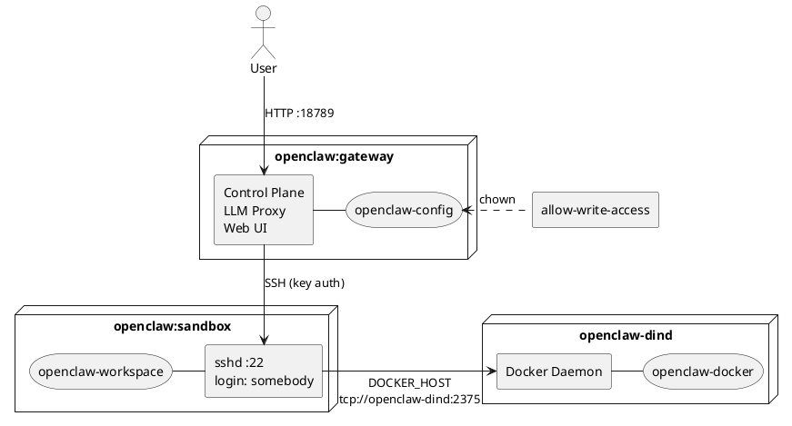

# OpenClaw — Gateway + SSH Sandbox

Run OpenClaw in a secure environment. OpenClaw runs sandboxed in Docker containers:

- **gateway**: Control plane, LLM proxy, web UI (port 18789)
- **sandbox**: Ubuntu instance where the AI executes commands as unprivileged user `somebody`

The gateway accesses the sandbox via SSH key authentication.

## Security Model

The primary security mechanism is **strict isolation**: The AI runs in a dedicated sandbox container that contains only its tools and workspace — no host secrets, no production data, no unrelated resources.

All further measures reinforce this model:

- **Workspace restriction** (`tools.fs.workspaceOnly: true`) — File tools limited to the sandbox workspace
- **Loop detection** (`loopDetection`) — Circuit breaker against tool/agent loops (threshold: 10)
- **No port over-exposure** — Only port 18789 (UI/API) is published; internal ports stay internal
- **Container hardening** — `no-new-privileges`, `pids_limit: 256` against escalation and fork bombs
- **Network isolation** — Containers communicate on an internal Docker network only
- **Docker-in-Docker isolation** — Sandbox uses a dedicated Docker daemon (`docker:dind`), no access to host Docker
- **Secrets + encrypted networks for production** — Docker Secrets instead of ENV, encrypted overlay in Swarm

### What `workspaceOnly` Does NOT Protect

The `workspaceOnly` setting restricts OpenClaw's **file tools** to the workspace. However, `exec`/shell commands can still read container system files (e.g. `/etc/passwd`, `/proc`). This is acceptable because the sandbox is an isolated container — there are no host secrets inside it.

### `strictHostKeyChecking: false`

Acceptable in a controlled internal Docker network where DNS is managed by Docker. For production hardening, consider pinning host keys.

## Development Setup

For local testing with `docker compose` and `.env` file.

### 1. Generate SSH Keypair and .env

```bash
ssh-keygen -t ed25519 -f openclaw-key -N "" -C "openclaw-sandbox"
cat > .env <<EOF
OPENCLAW_GATEWAY_TOKEN=$(pwgen 40 1)
OPENCLAW_SANDBOX_SSH_PUBLIC_KEY=$(cat openclaw-key.pub)
OPENCLAW_SANDBOX_SSH_PRIVATE_KEY=$(sed -z 's/\n/\\n/g' openclaw-key)
OPENAI_API_KEY=sk-...
EOF
rm openclaw-key.pub
```

Set `OPENAI_API_KEY` to your OpenAI API key from https://platform.openai.com/api-keys.

### 2. Start

```bash
docker compose up -d --build
```

Control UI: `http://localhost:18789/`

**This is for local / trusted-network use only.** The gateway token is transmitted unencrypted. Do not expose port 18789 to the internet without a TLS reverse proxy.

## Production Setup (Docker Swarm)

For production, use **Docker Secrets** and **encrypted overlay networks**.

### 1. Create Secrets

```bash
ssh-keygen -t ed25519 -f openclaw-key -N "" -C "openclaw-sandbox"
pwgen 40 1 | docker secret create openclaw_gateway_token -
docker secret create openclaw_sandbox_ssh_private_key openclaw-key
docker secret create openclaw_sandbox_ssh_public_key openclaw-key.pub
echo "sk-..." | docker secret create openai_api_key -
rm openclaw-key openclaw-key.pub
```

### 2. Encrypted Network

```bash
docker network create --driver overlay --opt encrypted openclaw
```

This enables IPsec encryption for all traffic between swarm nodes.

### 3. Deploy

Use `docker stack deploy` with a production compose file that references secrets:

```yaml
secrets:
  openclaw_gateway_token:
    external: true
  openclaw_sandbox_ssh_private_key:
    external: true
  openclaw_sandbox_ssh_public_key:
    external: true
  openai_api_key:
    external: true
```

Entrypoints automatically read from `/run/secrets/` when environment variables are empty.

### Automatic Secret-to-Environment Mapping

The gateway entrypoint iterates over all files in `/run/secrets/` and exports each as an environment variable. The filename is uppercased and dashes are replaced by underscores:

| Secret file | Environment variable |
|---|---|
| `/run/secrets/openai_api_key` | `OPENAI_API_KEY` |
| `/run/secrets/openclaw_sandbox_ssh_private_key` | `OPENCLAW_SANDBOX_SSH_PRIVATE_KEY` |

The sandbox reads its public key directly from `/run/secrets/openclaw_sandbox_ssh_public_key` (fallback when `OPENCLAW_SANDBOX_SSH_PUBLIC_KEY` is not set).

This means any Docker Secret is automatically available as an environment variable — no explicit mapping required. Secrets take precedence over environment variables set via `environment:` in Compose.

### Production Checklist

- [ ] All secrets via `docker secret`, not environment variables
- [ ] Encrypted overlay network (`--opt encrypted`)
- [ ] Port 18789 behind TLS reverse proxy (nginx, Traefik, Kong)
- [ ] Port 18790 not exposed (internal bridge only)
- [ ] Firewall restricts access to gateway port
- [ ] Consider `read_only: true` + `tmpfs` mounts if OpenClaw supports it

## Environment Variables

| Variable | Required | Description |
|---|---|---|
| `OPENCLAW_GATEWAY_TOKEN` | yes | Shared secret for Control UI |
| `OPENCLAW_SANDBOX_SSH_PUBLIC_KEY` | yes | SSH public key (ed25519) for sandbox access |
| `OPENAI_API_KEY` | yes | OpenAI API key |
| `OPENCLAW_SANDBOX_SSH_PRIVATE_KEY` | yes | SSH private key, `\n`-encoded (gateway → sandbox) |
| `OPENCLAW_CONFIG_DIR` | no | Host path for config (default: Docker volume) |
| `OPENCLAW_GATEWAY_PORT` | no | Gateway port (default: 18789) |

## Custom Configuration

The default `openclaw.json` is baked into the gateway image. On first start, it is copied to `~/.openclaw/openclaw.json`. To use your own configuration, mount or copy a custom `openclaw.json` into the config volume:

```bash
# Copy into the running container
docker cp my-openclaw.json openclaw-gateway-1:/home/node/.openclaw/openclaw.json

# Or mount a host directory
# OPENCLAW_CONFIG_DIR=/path/to/my/config docker compose up -d
```

The entrypoint only copies the default config if `~/.openclaw/openclaw.json` does not already exist. Your custom config is preserved across restarts.

## Docker-in-Docker (Optional)

The `openclaw-dind` service provides an isolated Docker daemon for the sandbox. It is **optional** — simply remove the `openclaw-dind` service and the `DOCKER_HOST` environment variable from the sandbox to disable it.

**Who needs this?** Developers and DevOps engineers who want OpenClaw to autonomously build, run, and test containerized applications. For general use (writing, research, scripting), DinD is not needed.

**Security warning:** The AI has full root access inside the DinD daemon. It can mount the DinD container's root filesystem, destroy all images/containers, or exhaust disk space on the `openclaw-docker` volume. DinD is isolated from the host Docker, but within its own daemon the AI has unrestricted access. Only enable this if you accept that risk.

## Architecture


