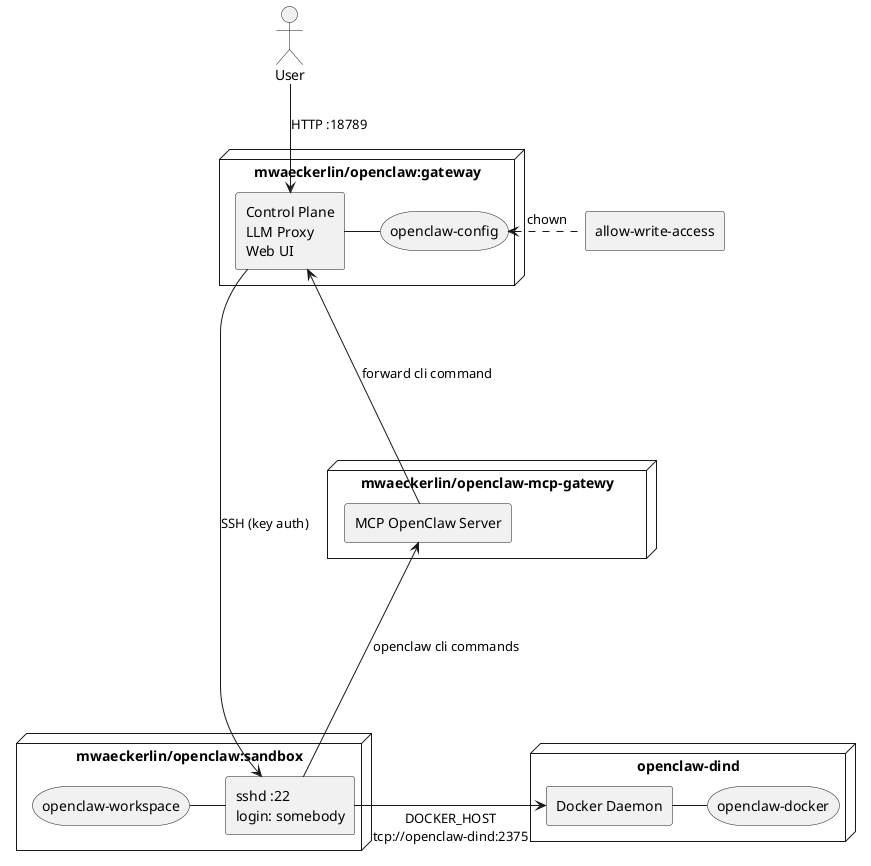

# OpenClaw — Gateway + SSH Sandbox

Run OpenClaw in a Docker-based sandboxed setup, locally or in cloud environments.

Set configuration variables in `.env`, run `npm start`, and access the instance at `http://localhost:18789/`.

For a simple `.env` setup, see [Development Setup](#development-setup) below.

## Security Model

The primary security mechanism is **strict isolation**: The AI runs in a dedicated sandbox container that contains only its tools and workspace — no host secrets, no production data, no unrelated resources.

All further measures reinforce this model:

- **Workspace restriction** (`tools.fs.workspaceOnly: true`) — File tools limited to the sandbox workspace
- **Loop detection** (`loopDetection`) — Circuit breaker against tool/agent loops (threshold: 10)
- **No port over-exposure** — Only port 18789 (UI/API) is published; internal ports stay internal
- **Container hardening** — `no-new-privileges`, `pids_limit: 256` against escalation and fork bombs
- **Network isolation** — Containers communicate on an internal Docker network only
- **Docker-in-Docker isolation** — Sandbox uses a dedicated Docker daemon (`docker:dind`), no access to host Docker
- **Secrets + encrypted networks for production** — Docker Secrets instead of ENV, encrypted overlay in Swarm

### What `workspaceOnly` Does NOT Protect

The `workspaceOnly` setting restricts OpenClaw's **file tools** to the workspace. However, `exec`/shell commands can still read container system files (e.g. `/etc/passwd`, `/proc`). This is acceptable because the sandbox is an isolated container — there are no host secrets inside it.

### `strictHostKeyChecking: false`

Acceptable in a controlled internal Docker network where DNS is managed by Docker. For production hardening, consider pinning host keys.

## Development Setup

For local testing with `docker compose` and `.env` file.

### 1. Generate SSH Keypair and .env

```bash
ssh-keygen -t ed25519 -f openclaw-key -N "" -C "openclaw-sandbox"
cat > .env <<EOF
OPENCLAW_GATEWAY_TOKEN=$(pwgen 40 1)
OPENCLAW_SANDBOX_SSH_PUBLIC_KEY=$(cat openclaw-key.pub)
OPENCLAW_SANDBOX_SSH_PRIVATE_KEY=$(sed -z 's/\n/\\n/g' openclaw-key)
OPENAI_API_KEY=sk-...
EOF
rm openclaw-key.pub
```

Set `OPENAI_API_KEY` to your OpenAI API key from https://platform.openai.com/api-keys.

### 2. Generate MCP Gateway Device Pairing

If you use the MCP gateway (enabled by default), generate a device keypair for secure gateway-to-MCP communication:

```bash
node generate-device-pairing.mjs
```

This appends `OPENCLAW_DEVICE_IDENTITY` and `OPENCLAW_DEVICE_PAIRING` to `.env`. The MCP gateway uses the private key to authenticate, and the OpenClaw gateway pre-registers the public key so the device is trusted on first connect.

Use `--stdout` to print the values instead of writing to `.env`.

### 3. Start

**In foreground (see logs in real-time):**
```bash
npm start
```

**In background (daemon mode):**
```bash
npm run start:daemon
```

Control UI: `http://localhost:18789/`

**This is for local / trusted-network use only.** The gateway token is transmitted unencrypted. Do not expose port 18789 to the internet without a TLS reverse proxy.

## Production Setup (Docker Swarm)

For production, use **Docker Secrets** and **encrypted overlay networks**.

### 1. Create Secrets

```bash
ssh-keygen -t ed25519 -f openclaw-key -N "" -C "openclaw-sandbox"
pwgen 40 1 | docker secret create openclaw_gateway_token -
docker secret create openclaw_sandbox_ssh_private_key openclaw-key
docker secret create openclaw_sandbox_ssh_public_key openclaw-key.pub
echo "sk-..." | docker secret create openai_api_key -
rm openclaw-key openclaw-key.pub
```

### 2. Encrypted Network

```bash
docker network create --driver overlay --opt encrypted openclaw
```

This enables IPsec encryption for all traffic between swarm nodes.

### 3. Deploy

Use `docker stack deploy` with a production compose file that references secrets:

```yaml
secrets:
  openclaw_gateway_token:
    external: true
  openclaw_sandbox_ssh_private_key:
    external: true
  openclaw_sandbox_ssh_public_key:
    external: true
  openai_api_key:
    external: true
```

Entrypoints automatically read from `/run/secrets/` when environment variables are empty.

### Automatic Secret-to-Environment Mapping

The gateway entrypoint iterates over all files in `/run/secrets/` and exports each as an environment variable. The filename is uppercased and dashes are replaced by underscores:

| Secret file | Environment variable |
|---|---|
| `/run/secrets/openai_api_key` | `OPENAI_API_KEY` |
| `/run/secrets/openclaw_sandbox_ssh_private_key` | `OPENCLAW_SANDBOX_SSH_PRIVATE_KEY` |

The sandbox reads its public key directly from `/run/secrets/openclaw_sandbox_ssh_public_key` (fallback when `OPENCLAW_SANDBOX_SSH_PUBLIC_KEY` is not set).

This means any Docker Secret is automatically available as an environment variable — no explicit mapping required. Secrets take precedence over environment variables set via `environment:` in Compose.

### Production Checklist

- [ ] All secrets via `docker secret`, not environment variables
- [ ] Encrypted overlay network (`--opt encrypted`)
- [ ] Port 18789 behind TLS reverse proxy (nginx, Traefik, Kong)
- [ ] Port 18790 not exposed (internal bridge only)
- [ ] Firewall restricts access to gateway port
- [ ] Consider `read_only: true` + `tmpfs` mounts if OpenClaw supports it

## Environment Variables

### Core Configuration

| Variable | Required | Description |
|---|---|---|
| `OPENCLAW_GATEWAY_TOKEN` | yes | Shared secret for Control UI |
| `OPENCLAW_SANDBOX_SSH_PUBLIC_KEY` | yes | SSH public key (ed25519) for sandbox access |
| `OPENCLAW_SANDBOX_SSH_PRIVATE_KEY` | yes | SSH private key, `\n`-encoded (gateway → sandbox) |
| `OPENAI_API_KEY` | no | OpenAI API key; enables OpenAI provider, Whisper audio transcription, and is used as default model provider if `LITELLM_MASTER_KEY` is not set |
| `OPENCLAW_WHISPER_API_KEY` | no | Whisper API key override; if unset and `OPENAI_API_KEY` is set, it is derived from `OPENAI_API_KEY` |
| `OVERWRITE_CONFIG` | no | If set, overwrite `openclaw.json` with the baked-in default on every start |
| `OPENCLAW_CONFIG_DIR` | no | Host path for config (default: Docker volume) |
| `OPENCLAW_STATE_DIR` | no | OpenClaw state directory path inside the gateway container (defaults to `~/.openclaw`) |
| `OPENCLAW_GATEWAY_PORT` | no | Gateway port (default: 18789) |

### Optional Feature Enablement (via API Keys)

| Variable | Default | Description |
|---|---|---|
| `OPENCLAW_ELEVENLABS_API_KEY` | — | ElevenLabs API key; enables TTS via ElevenLabs (else Microsoft TTS) |
| `OPENCLAW_NOTION_API_KEY` | — | Notion API key; enables Notion skill |
| `OPENCLAW_GITHUB_TOKEN` | — | GitHub personal access token; enables GitHub MCP server via ACPX (token stays gateway-side, sandbox only sees MCP tools) |
| `OPENCLAW_GITEA_HOST` | — | Gitea host URL for ACPX MCP server setup |
| `OPENCLAW_GITEA_TOKEN` | — | Gitea personal access token; enables Gitea MCP server via ACPX |
| `OPENCLAW_GITEA_INSECURE` | — | Optional Gitea MCP setting (`GITEA_INSECURE`) |
| `OPENCLAW_TRELLO_API_KEY` | — | Trello API key; enables Trello skill |
| `OPENCLAW_TELEGRAM_BOT_TOKEN` | — | Telegram bot token; enables Telegram channel |
| `OPENCLAW_DISCORD_BOT_TOKEN` | — | Discord bot token; enables Discord channel |
| `OPENCLAW_SLACK_BOT_TOKEN` | — | Slack bot token; enables Slack channel |
| `OPENCLAW_SLACK_APP_TOKEN` | — | Slack app token for socket mode (`channels.slack.appToken`) |
| `OPENCLAW_BRAVE_API_KEY` | — | Brave Search API key; enables Brave plugin (else DuckDuckGo) |
| `OPENCLAW_GOOGLECHAT_SERVICE_ACCOUNT_JSON` | — | Google Chat service account JSON; enables Google Chat channel |
| `OPENCLAW_GOOGLECHAT_SERVICE_ACCOUNT_FILE` | — | Path to Google Chat service account file |
| `OPENCLAW_MATTERMOST_BOT_TOKEN` | — | Mattermost bot token; enables Mattermost channel |
| `OPENCLAW_MATTERMOST_BASE_URL` | — | Mattermost base URL |
| `OPENCLAW_MATRIX_HOMESERVER` | — | Matrix homeserver URL |
| `OPENCLAW_MATRIX_ACCESS_TOKEN` | — | Matrix access token; enables Matrix channel |
| `OPENCLAW_MSTEAMS_APP_ID` | — | Microsoft Teams app ID |
| `OPENCLAW_MSTEAMS_APP_PASSWORD` | — | Microsoft Teams app password |
| `OPENCLAW_MSTEAMS_TENANT_ID` | — | Microsoft Teams tenant ID |
| `OPENCLAW_BLUEBUBBLES_SERVER_URL` | — | BlueBubbles server URL |
| `OPENCLAW_BLUEBUBBLES_PASSWORD` | — | BlueBubbles password |
| `OPENCLAW_IRC_NICKSERV_PASSWORD` | — | IRC NickServ password |

### LiteLLM Configuration (Optional)

When `LITELLM_MASTER_KEY` is set, LiteLLM is enabled as model provider and the default model switches to `litellm/openrouter/anthropic/claude-sonnet-4`. Without it, OpenAI is used directly with `openai/gpt-4o` as default.

| Variable | Default | Description |
|---|---|---|
| `LITELLM_MASTER_KEY` | — | Bearer token for LiteLLM API authentication; enables LiteLLM provider |
| `LITELLM_URL` | — | Base URL of LiteLLM proxy for model discovery |
| `LITELLM_BASE_URL` | `http://litellm:4000` | Base URL for connecting to LiteLLM |

When configured, model lists are discovered dynamically from providers:

- LiteLLM: `LITELLM_URL/v1/models` → `models.providers.litellm.models`
- OpenAI: `${OPENCLAW_OPENAI_BASE_URL:-https://api.openai.com/v1}/models` → `models.providers.openai.models` (unless `OPENCLAW_OPENAI_MODELS_JSON` is explicitly set)

### Agent & Model Configuration

| Variable | Default | Description |
|---|---|---|
| `OPENCLAW_PRIMARY_MODEL` | _(auto)_ | Default LLM model; auto-selects `litellm/openrouter/anthropic/claude-sonnet-4` if LiteLLM is configured, else `openai/gpt-4o` |
| `OPENCLAW_HEARTBEAT_INTERVAL` | `0s` | Duration for agent heartbeat (e.g. `30m`, `2h`, `0s` = disabled) |
| `OPENCLAW_TIMEOUT_SECONDS` | `300` | Agent execution timeout in seconds |
| `OPENCLAW_MAX_CONCURRENT` | `5` | Maximum concurrent agents |
| `OPENCLAW_CRON_ENABLED` | `true` | Enable cron scheduler support |
| `OPENCLAW_BASE_PATH` | _(empty)_ | Base path for Control UI (e.g. `/openclaw` behind reverse proxy) |
| `OPENCLAW_AGENT_SCOPE` | `agent` | Sandbox scope for agent sessions; allowed: `session`, `agent`, `shared` |
| `OPENCLAW_DM_SCOPE` | `main` | DM scope for session routing; allowed: `main`, `per-peer`, `per-channel-peer`, `per-account-channel-peer` |
| `OPENCLAW_SESSION_VISIBILITY` | `agent` | Session visibility for tools; allowed: `agent`, `global` |
| `OPENCLAW_SESSION_TOOLS_VISIBILITY` | `all` | Which tools are visible in sandbox sessions; allowed: `all`, `none` |

### Plugin Configuration & Installation

| Variable | Default | Description |
|---|---|---|
| `OPENCLAW_PLUGINS_JSON` | — | Full `plugins` section as JSON |
| `OPENCLAW_PLUGIN_ENTRIES_JSON` | — | Additional `plugins.entries` object merged into the generated config |
| `OPENCLAW_PLUGIN_SPECS_JSON` | — | Map `{ "<pluginId>": "<install-spec>" }` for plugin auto-install resolution |
| `OPENCLAW_PLUGIN_AUTO_INSTALL_ENABLED` | `true` | Auto-install plugin specs referenced in `plugins.entries` when not installed |
| `OPENCLAW_PLUGIN_AUTO_INSTALL_STRICT` | `false` | Fail startup when a plugin install fails |
| `OPENCLAW_PLUGIN_AUTO_INSTALL_PREFIX` | `@openclaw/` | Default prefix used when no explicit spec is provided |
| `OPENCLAW_PLUGIN_AUTO_INSTALL_SKIP_JSON` | `["acpx","brave","duckduckgo"]` | Plugin ID list excluded from auto-install |
| `PLUGINS` | — | Manual install spec passed to `openclaw plugins install` |

Example:

```bash
OPENCLAW_PLUGIN_ENTRIES_JSON='{"matrix":{"enabled":true,"config":{"homeserver":"https://matrix.example","accessToken":"${OPENCLAW_MATRIX_ACCESS_TOKEN}"}}}'
OPENCLAW_PLUGIN_SPECS_JSON='{"matrix":"@openclaw/matrix"}'
OPENCLAW_PLUGIN_AUTO_INSTALL_ENABLED=true
```

### Full OpenClaw Config Coverage (Schema Roots)

Each root section in `files/openclaw.json.j2` is configurable via a section JSON variable:

`OPENCLAW_<SECTION>_JSON`

Example:

```bash
OPENCLAW_GATEWAY_JSON='{"mode":"local","bind":"lan","port":18789,"auth":{"mode":"token","token":"${OPENCLAW_GATEWAY_TOKEN}"},"trustedProxies":["10.0.0.0/8","172.16.0.0/12","192.168.0.0/16"]}'
```

Supported section variables (from official OpenClaw schema roots):

`OPENCLAW_META_JSON`, `OPENCLAW_ENV_JSON`, `OPENCLAW_WIZARD_JSON`, `OPENCLAW_DIAGNOSTICS_JSON`, `OPENCLAW_LOGGING_JSON`, `OPENCLAW_CLI_JSON`, `OPENCLAW_UPDATE_JSON`, `OPENCLAW_BROWSER_JSON`, `OPENCLAW_UI_JSON`, `OPENCLAW_SECRETS_JSON`, `OPENCLAW_AUTH_JSON`, `OPENCLAW_ACP_JSON`, `OPENCLAW_MODELS_JSON`, `OPENCLAW_NODE_HOST_JSON`, `OPENCLAW_AGENTS_JSON`, `OPENCLAW_TOOLS_JSON`, `OPENCLAW_BINDINGS_JSON`, `OPENCLAW_BROADCAST_JSON`, `OPENCLAW_AUDIO_JSON`, `OPENCLAW_MEDIA_JSON`, `OPENCLAW_MESSAGES_JSON`, `OPENCLAW_COMMANDS_JSON`, `OPENCLAW_APPROVALS_JSON`, `OPENCLAW_SESSION_JSON`, `OPENCLAW_CRON_JSON`, `OPENCLAW_HOOKS_JSON`, `OPENCLAW_WEB_JSON`, `OPENCLAW_CHANNELS_JSON`, `OPENCLAW_DISCOVERY_JSON`, `OPENCLAW_CANVAS_HOST_JSON`, `OPENCLAW_TALK_JSON`, `OPENCLAW_GATEWAY_JSON`, `OPENCLAW_MEMORY_JSON`, `OPENCLAW_MCP_JSON`, `OPENCLAW_SKILLS_JSON`, `OPENCLAW_PLUGINS_JSON`.

If `OPENCLAW_<SECTION>_JSON` is set, it replaces that full section from the template.
If not set, the template defaults and feature toggles apply.

Plugin configurations are supported in two modes:

- complete plugin section replacement via `OPENCLAW_PLUGINS_JSON`
- additive plugin entry mapping via `OPENCLAW_PLUGIN_ENTRIES_JSON`

### Individual Overrides (Per-Parameter)

Neben den Block-Overrides sind die meisten sinnvollen Einzelwerte direkt per ENV überschreibbar (ohne die SSH-Sandbox-Zielstruktur aufzuweichen).

Wichtige Gruppen:

- Models/Provider: `OPENCLAW_MODELS_MODE`, `OPENCLAW_LITELLM_API`, `OPENCLAW_LITELLM_MODELS_JSON`, `OPENCLAW_OPENAI_BASE_URL`, `OPENCLAW_OPENAI_MODELS_JSON`, `OPENCLAW_AGENT_MODELS_JSON`
- Agent runtime: `OPENCLAW_AGENT_SANDBOX_MODE`, `OPENCLAW_AGENT_WORKSPACE_ACCESS`, `OPENCLAW_SUBAGENT_TIMEOUT_SECONDS`, `OPENCLAW_SUBAGENT_MAX_CONCURRENT`
- Tools/media: `OPENCLAW_TOOLS_FS_WORKSPACE_ONLY`, `OPENCLAW_LOOP_DETECTION_*`, `OPENCLAW_MEDIA_AUDIO_*`
- Messages/commands/hooks: `OPENCLAW_TTS_*`, `OPENCLAW_MESSAGES_QUEUE_*`, `OPENCLAW_COMMANDS_*`, `OPENCLAW_HOOKS_*`
- Channels: `OPENCLAW_TELEGRAM_*`, `OPENCLAW_DISCORD_*`, `OPENCLAW_SLACK_*`
- Gateway: `OPENCLAW_GATEWAY_MODE`, `OPENCLAW_GATEWAY_BIND`, `OPENCLAW_GATEWAY_INTERNAL_PORT`, `OPENCLAW_GATEWAY_AUTH_MODE`, `OPENCLAW_CONTROL_UI_*`, `OPENCLAW_TAILSCALE_*`, `OPENCLAW_TRUSTED_PROXIES_JSON`
- ACPX/MCP: `OPENCLAW_ACPX_*`, `OPENCLAW_GITHUB_TOKEN`, `OPENCLAW_GITEA_HOST`, `OPENCLAW_GITEA_TOKEN`, `OPENCLAW_GITEA_INSECURE`
- Sandbox bridge env: `OPENCLAW_MCP_GATEWAY_URL`

Token/Secret-basierte Channels haben bewusst **kein** separates `*_ENABLED`: das Token/Secret ist der Enabler.

Vollständige Liste der Einzel-Overrides:

```bash
OPENCLAW_LOGGING_LEVEL
OPENCLAW_AUTH_PROFILE_PROVIDER
OPENCLAW_AUTH_PROFILE_MODE
OPENCLAW_MODELS_MODE
OPENCLAW_LITELLM_API
OPENCLAW_LITELLM_MODELS_JSON
OPENCLAW_OPENAI_BASE_URL
OPENCLAW_OPENAI_MODELS_JSON
OPENCLAW_AGENT_SANDBOX_MODE
OPENCLAW_AGENT_WORKSPACE_ACCESS
OPENCLAW_AGENT_MODELS_JSON
OPENCLAW_SUBAGENT_TIMEOUT_SECONDS
OPENCLAW_SUBAGENT_MAX_CONCURRENT
OPENCLAW_TOOLS_FS_WORKSPACE_ONLY
OPENCLAW_LOOP_DETECTION_ENABLED
OPENCLAW_LOOP_DETECTION_WARNING_THRESHOLD
OPENCLAW_LOOP_DETECTION_CRITICAL_THRESHOLD
OPENCLAW_LOOP_DETECTION_GLOBAL_CIRCUIT_BREAKER_THRESHOLD
OPENCLAW_MEDIA_AUDIO_ENABLED
OPENCLAW_MEDIA_AUDIO_ECHO_TRANSCRIPT
OPENCLAW_MEDIA_AUDIO_PROVIDER
OPENCLAW_MEDIA_AUDIO_MODEL
OPENCLAW_TTS_AUTO
OPENCLAW_TTS_PROVIDER
OPENCLAW_TTS_MODEL_OVERRIDES_ENABLED
OPENCLAW_MESSAGES_QUEUE_DEBOUNCE_MS
OPENCLAW_MESSAGES_QUEUE_CAP
OPENCLAW_COMMANDS_NATIVE
OPENCLAW_COMMANDS_NATIVE_SKILLS
OPENCLAW_COMMANDS_RESTART
OPENCLAW_COMMANDS_OWNER_DISPLAY
OPENCLAW_HOOKS_INTERNAL_ENABLED
OPENCLAW_HOOKS_COMMAND_LOGGER_ENABLED
OPENCLAW_HOOKS_SESSION_MEMORY_ENABLED
OPENCLAW_HOOKS_BOOTSTRAP_EXTRA_FILES_ENABLED
OPENCLAW_HOOKS_BOOT_MD_ENABLED
OPENCLAW_TELEGRAM_DM_POLICY
OPENCLAW_TELEGRAM_ALLOW_FROM_JSON
OPENCLAW_TELEGRAM_GROUPS_JSON
OPENCLAW_TELEGRAM_GROUP_POLICY
OPENCLAW_TELEGRAM_STREAMING_MODE
OPENCLAW_DISCORD_DM_POLICY
OPENCLAW_DISCORD_ALLOW_FROM_JSON
OPENCLAW_DISCORD_STREAMING_MODE
OPENCLAW_SLACK_APP_TOKEN
OPENCLAW_SLACK_DM_POLICY
OPENCLAW_SLACK_ALLOW_FROM_JSON
OPENCLAW_SLACK_NATIVE_TRANSPORT
OPENCLAW_SLACK_STREAMING_MODE
OPENCLAW_WHATSAPP_ENABLED
OPENCLAW_WHATSAPP_DM_POLICY
OPENCLAW_WHATSAPP_ALLOW_FROM_JSON
OPENCLAW_WHATSAPP_TEXT_CHUNK_LIMIT
OPENCLAW_WHATSAPP_CHUNK_MODE
OPENCLAW_WHATSAPP_MEDIA_MAX_MB
OPENCLAW_WHATSAPP_SEND_READ_RECEIPTS
OPENCLAW_WHATSAPP_GROUPS_JSON
OPENCLAW_WHATSAPP_GROUP_POLICY
OPENCLAW_CHANNEL_DEFAULTS_JSON
OPENCLAW_GOOGLECHAT_SERVICE_ACCOUNT_JSON
OPENCLAW_GOOGLECHAT_SERVICE_ACCOUNT_FILE
OPENCLAW_GOOGLECHAT_DM_ENABLED
OPENCLAW_GOOGLECHAT_DM_POLICY
OPENCLAW_GOOGLECHAT_ALLOW_FROM_JSON
OPENCLAW_GOOGLECHAT_GROUP_POLICY
OPENCLAW_MATTERMOST_BOT_TOKEN
OPENCLAW_MATTERMOST_BASE_URL
OPENCLAW_MATTERMOST_DM_POLICY
OPENCLAW_SIGNAL_ENABLED
OPENCLAW_SIGNAL_ACCOUNT
OPENCLAW_SIGNAL_DM_POLICY
OPENCLAW_SIGNAL_ALLOW_FROM_JSON
OPENCLAW_BLUEBUBBLES_DM_POLICY
OPENCLAW_BLUEBUBBLES_SERVER_URL
OPENCLAW_BLUEBUBBLES_PASSWORD
OPENCLAW_IMESSAGE_ENABLED
OPENCLAW_IMESSAGE_DM_POLICY
OPENCLAW_IMESSAGE_ALLOW_FROM_JSON
OPENCLAW_MATRIX_HOMESERVER
OPENCLAW_MATRIX_ACCESS_TOKEN
OPENCLAW_MSTEAMS_CONFIG_WRITES
OPENCLAW_MSTEAMS_APP_ID
OPENCLAW_MSTEAMS_APP_PASSWORD
OPENCLAW_MSTEAMS_TENANT_ID
OPENCLAW_IRC_ENABLED
OPENCLAW_IRC_DM_POLICY
OPENCLAW_IRC_CONFIG_WRITES
OPENCLAW_IRC_HOST
OPENCLAW_IRC_PORT
OPENCLAW_IRC_TLS
OPENCLAW_IRC_NICKSERV_ENABLED
OPENCLAW_IRC_NICKSERV_SERVICE
OPENCLAW_IRC_NICKSERV_PASSWORD
OPENCLAW_IRC_NICKSERV_REGISTER
OPENCLAW_IRC_NICKSERV_REGISTER_EMAIL
OPENCLAW_EXTRA_CHANNELS_JSON
OPENCLAW_GATEWAY_MODE
OPENCLAW_GATEWAY_BIND
OPENCLAW_GATEWAY_INTERNAL_PORT
OPENCLAW_GATEWAY_AUTH_MODE
OPENCLAW_CONTROL_UI_ENABLED
OPENCLAW_CONTROL_UI_ALLOW_HOST_HEADER_ORIGIN_FALLBACK
OPENCLAW_CONTROL_UI_ALLOW_INSECURE_AUTH
OPENCLAW_CONTROL_UI_DISABLE_DEVICE_AUTH
OPENCLAW_ALLOWED_ORIGINS_JSON
OPENCLAW_TAILSCALE_MODE
OPENCLAW_TAILSCALE_RESET_ON_EXIT
OPENCLAW_TRUSTED_PROXIES_JSON
OPENCLAW_SKILLS_INSTALL_NODE_MANAGER
OPENCLAW_BRAVE_ENABLED
OPENCLAW_DUCKDUCKGO_ENABLED
OPENCLAW_ACPX_ENABLED
OPENCLAW_ACPX_GITHUB_COMMAND
OPENCLAW_ACPX_GITHUB_ARGS_JSON
OPENCLAW_ACPX_GITEA_COMMAND
OPENCLAW_ACPX_GITEA_ARGS_JSON
OPENCLAW_GITEA_HOST
OPENCLAW_GITEA_TOKEN
OPENCLAW_GITEA_INSECURE
OPENCLAW_MCP_GATEWAY_URL
OPENCLAW_PLUGIN_ENTRIES_JSON
OPENCLAW_PLUGIN_SPECS_JSON
OPENCLAW_PLUGIN_AUTO_INSTALL_ENABLED
OPENCLAW_PLUGIN_AUTO_INSTALL_STRICT
OPENCLAW_PLUGIN_AUTO_INSTALL_PREFIX
OPENCLAW_PLUGIN_AUTO_INSTALL_SKIP_JSON
PLUGINS
```

Pflichtpunkt ohne Default-Hardcoding:

- `OPENCLAW_ALLOWED_ORIGINS_JSON` setzt `gateway.controlUi.allowedOrigins`.
- Es gibt dafür **keinen** eingebauten Default mehr; wenn nicht gesetzt, wird `allowedOrigins` nicht in die Config geschrieben.

Model-Handling:

- Agent-Model-Mappings sind über `OPENCLAW_AGENT_MODELS_JSON` konfigurierbar.
- Provider-Modelle werden generisch über den jeweiligen Provider geführt (`models.providers.*.models`, LiteLLM Discovery via `LITELLM_URL` + `LITELLM_MASTER_KEY`).

### Configuration Features

The OpenClaw configuration is **Jinja2-templated**, allowing dynamic feature enablement based on environment variables. Features are **only included in the generated config if their corresponding API keys are provided**.

**Examples:**

**Minimal setup** (only required vars):
```bash
npm start  # Config has only gateway + sandbox + basic tools
```

**With Telegram channel** (add to .env):
```bash
OPENCLAW_TELEGRAM_BOT_TOKEN=123:ABC...
npm start  # Telegram channel included in config
```

**With all skills and channels** (add to .env):
```bash
OPENCLAW_NOTION_API_KEY=...
OPENCLAW_GITHUB_TOKEN=...
OPENCLAW_TELEGRAM_BOT_TOKEN=...
OPENCLAW_DISCORD_BOT_TOKEN=...
OPENCLAW_ELEVENLABS_API_KEY=...  # enables TTS
npm start  # All features enabled
```

**Production with Docker Secrets** (in compose file):
```yaml
services:
  openclaw-gateway:
    environment:
      # Pass empty - mapped from secrets automatically
      OPENCLAW_GATEWAY_TOKEN: ${OPENCLAW_GATEWAY_TOKEN:-}
      OPENCLAW_WHISPER_API_KEY: ${OPENCLAW_WHISPER_API_KEY:-}
      # ... other feature keys
```

Then provide secrets via docker secret or mounted `/run/secrets/*` files.

#### Conditional Features

- **LiteLLM**: Enabled if `LITELLM_MASTER_KEY` set; adds LiteLLM provider and auth profile
- **OpenAI**: Enabled if `OPENAI_API_KEY` set; adds OpenAI provider
- **Default Model**: `litellm/openrouter/anthropic/claude-sonnet-4` with LiteLLM, `openai/gpt-4o` without; override with `OPENCLAW_PRIMARY_MODEL`
- **Audio (Whisper)**: Enabled if `OPENAI_API_KEY` set
- **TTS Provider**: ElevenLabs if `OPENCLAW_ELEVENLABS_API_KEY` set, else Microsoft
- **Search Plugin**: Brave if `OPENCLAW_BRAVE_API_KEY` set, else DuckDuckGo (always present)
- **Cron Scheduler**: Enabled by default (`OPENCLAW_CRON_ENABLED=true`); set to `false` to disable
- **Channels**: Telegram, Discord, Slack, Google Chat, Mattermost, Matrix, Microsoft Teams, BlueBubbles are enabled by credentials/secrets; WhatsApp, Signal, iMessage, IRC by explicit channel config flags
- **GitHub/Gitea (ACPX)**: GitHub MCP server is included when `OPENCLAW_GITHUB_TOKEN` is set; Gitea MCP server is included when `OPENCLAW_GITEA_HOST` and `OPENCLAW_GITEA_TOKEN` are set
- **Skills**: Notion, Trello, ElevenLabs, OpenAI Whisper — only included if API keys provided
- **Plugins (generic)**: Any plugin config in `plugins.entries` is supported via `OPENCLAW_PLUGINS_JSON` or `OPENCLAW_PLUGIN_ENTRIES_JSON`; configured plugin IDs can be auto-installed on startup

#### Schema Source

The full section list above is taken from the official OpenClaw config schema in `openclaw/openclaw`:

- `src/config/schema.base.generated.ts` (branch `main`, commit `d63671fce0ce60a87fdf073b2d7a47ac4f9e04ef`)

## Custom Configuration

The default `openclaw.json` is baked into the gateway image. On first start, it is copied to `~/.openclaw/openclaw.json`. To use your own configuration, mount or copy a custom `openclaw.json` into the config volume:

```bash
# Copy into the running container
docker cp my-openclaw.json openclaw-gateway-1:/home/node/.openclaw/openclaw.json

# Or mount a host directory
# OPENCLAW_CONFIG_DIR=/path/to/my/config docker compose up -d
```

By default, the config is only copied on first start and preserved across restarts. The included `docker-compose.yml` sets `OVERWRITE_CONFIG=true` so the baked-in default is always written — unset it to keep manual changes.

## OpenClaw MCP Gateway (Optional)

The `openclaw-mcp-gateway` service ([mwaeckerlin/openclaw-mcp-gateway](https://github.com/mwaeckerlin/openclaw-mcp-gateway)) provides a secure MCP interface for the sandboxed AI agent to execute `openclaw` CLI commands in the server. It is **optional** — remove the `openclaw-mcp-gateway` service from `docker-compose.yml` to disable it.

**Who needs this?** Users who want the AI agent to manage cron jobs, check gateway status, list sessions and myn other functions from within the sandbox. Without the MCP gateway, the agent has no way to interact with the OpenClaw gateway (by design — the sandbox has no gateway token).

**What it does:** The MCP gateway holds the gateway token and exposes a fixed allowlist of operations (status checks, cron management) as MCP tools. The sandbox agent connects to the MCP gateway — never directly to the OpenClaw gateway. This keeps the gateway token out of the sandbox.

**Network isolation:** Always seggregate your networks. This is especieally important here, so that the agent in the SSH sandbox cannot sniff th etoken.

**Configuration:** `OPENCLAW_GATEWAY_TOKEN` must be set (same token as the main gateway). In production, use Docker secrets. `OPENCLAW_GATEWAY_URL` defaults to `http://openclaw-gateway:18789`. Override if your setup differs. The MCP gateway ships a skill file (`SKILL.md` in the [openclaw-mcp-gateway](https://github.com/mwaeckerlin/openclaw-mcp-gateway) repository) that teaches the agent how to use the MCP tools. Upload or paste the file into a chat with your agent and instruct it to install this skill as a local OpenClaw skill in `~/.openclaw/workspace/skills/openclaw-mcp-gateway/SKILL.md`

**Device pairing:** The MCP gateway authenticates to the OpenClaw gateway via an Ed25519 device identity. Generate the keypair with `node generate-device-pairing.mjs` (see [Development Setup](#development-setup)). This sets:

| Variable | Where | Description |
|---|---|---|
| `OPENCLAW_DEVICE_IDENTITY` | MCP gateway | JSON-encoded private key + deviceId for the MCP gateway |
| `OPENCLAW_DEVICE_PAIRING` | OpenClaw gateway | JSON-encoded pairing record; written verbatim to `devices/paired.json` |

Both are automatically read from `.env` by Docker Compose. In production, use Docker secrets (`openclaw_device_identity`, `openclaw_device_pairing`).

## Device Pre-Seeding (Optional)

Pre-seed one or more paired devices at gateway startup, so they are recognized on first connect without interactive approval. This is useful for headless setups, CI/CD pipelines, or automated deployments.

**Who needs this?** Admins who deploy OpenClaw without interactive access to the Control UI, e.g. in Docker Swarm, Kubernetes, or Ansible-managed environments.

Set `OPENCLAW_DEVICE_PAIRING` (env var) or provide the Docker secret `openclaw_device_pairing`. The value is a JSON string that is written **verbatim** to `$OPENCLAW_STATE_DIR/devices/paired.json` (default: `~/.openclaw/devices/paired.json`). The content is the **authoritative** pairing state — it replaces any existing `paired.json` on every startup.

**No transformation is applied.** The JSON must match OpenClaw's internal pairing structure exactly, as defined in `src/infra/device-pairing.ts`. The admin is responsible for providing the correct and complete structure. Refer to the OpenClaw source files for the current expected fields:

- `src/infra/device-pairing.ts` — pairing entry structure
- `src/infra/pairing-files.ts` — file paths and format
- `src/config/paths.ts` — `OPENCLAW_STATE_DIR` resolution

**Example** (in `.env`):

```bash
OPENCLAW_DEVICE_PAIRING='{"my-device":{"deviceId":"my-device","publicKey":"...","role":"operator","roles":["operator"],"scopes":["operator.admin"],"approvedScopes":["operator.admin"],"tokens":{"operator":{"token":"...","role":"operator","scopes":["operator.admin"],"createdAtMs":1713520000000}},"createdAtMs":1713520000000,"approvedAtMs":1713520000000}}'
```

**With Docker secrets:**

```bash
docker secret create openclaw_device_pairing pairing.json
```

The secret is auto-mapped to `OPENCLAW_DEVICE_PAIRING` by the gateway entrypoint.

## Docker-in-Docker (Optional)

The `openclaw-dind` service provides an isolated Docker daemon for the sandbox. It is **optional** — simply remove the `openclaw-dind` service and the `DOCKER_HOST` environment variable from the sandbox to disable it.

**Who needs this?** Developers and DevOps engineers who want OpenClaw to autonomously build, run, and test containerized applications. For general use (writing, research, scripting), DinD is not needed.

**Security warning:** The AI has full root access inside the DinD daemon. It can mount the DinD container's root filesystem, destroy all images/containers, or exhaust disk space on the `openclaw-docker` volume. DinD is isolated from the host Docker, but within its own daemon the AI has unrestricted access. Only enable this if you accept that risk.

### DinD in Docker Swarm

Docker Swarm does not support `privileged: true` in stack deploy files. Docker-in-Docker is therefore not supported in this Swarm setup.

## Architecture


