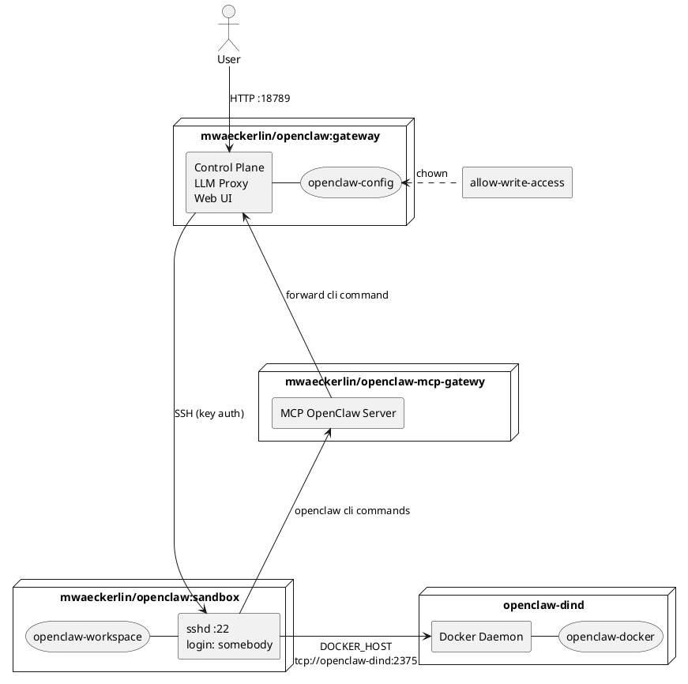

# OpenClaw — Gateway + SSH Sandbox

Combine OpenClaw with Security and Easiness! Run out of the box a secure docker based sandboxed OpenClaw, locally or in a cloud.

**It has never been so easy to run a secure sandboxed pre-configured OpenClaw!** — Just write some configuration variables in `.env`, run `npm start` and get your instance at: `http://localhost:18789/`

For a simple `.env` setup, see [Development Setup](#development-setup) below.

## Security Model

The primary security mechanism is **strict isolation**: The AI runs in a dedicated sandbox container that contains only its tools and workspace — no host secrets, no production data, no unrelated resources.

All further measures reinforce this model:

- **Workspace restriction** (`tools.fs.workspaceOnly: true`) — File tools limited to the sandbox workspace
- **Loop detection** (`loopDetection`) — Circuit breaker against tool/agent loops (threshold: 10)
- **No port over-exposure** — Only port 18789 (UI/API) is published; internal ports stay internal
- **Container hardening** — `no-new-privileges`, `pids_limit: 256` against escalation and fork bombs
- **Network isolation** — Containers communicate on an internal Docker network only
- **Docker-in-Docker isolation** — Sandbox uses a dedicated Docker daemon (`docker:dind`), no access to host Docker
- **Secrets + encrypted networks for production** — Docker Secrets instead of ENV, encrypted overlay in Swarm

### What `workspaceOnly` Does NOT Protect

The `workspaceOnly` setting restricts OpenClaw's **file tools** to the workspace. However, `exec`/shell commands can still read container system files (e.g. `/etc/passwd`, `/proc`). This is acceptable because the sandbox is an isolated container — there are no host secrets inside it.

### `strictHostKeyChecking: false`

Acceptable in a controlled internal Docker network where DNS is managed by Docker. For production hardening, consider pinning host keys.

## Development Setup

For local testing with `docker compose` and `.env` file.

### 1. Generate SSH Keypair and .env

```bash
ssh-keygen -t ed25519 -f openclaw-key -N "" -C "openclaw-sandbox"
cat > .env <<EOF
OPENCLAW_GATEWAY_TOKEN=$(pwgen 40 1)
OPENCLAW_SANDBOX_SSH_PUBLIC_KEY=$(cat openclaw-key.pub)
OPENCLAW_SANDBOX_SSH_PRIVATE_KEY=$(sed -z 's/\n/\\n/g' openclaw-key)
OPENAI_API_KEY=sk-...
EOF
rm openclaw-key.pub
```

Set `OPENAI_API_KEY` to your OpenAI API key from https://platform.openai.com/api-keys.

### 2. Start

**In foreground (see logs in real-time):**
```bash
npm start
```

**In background (daemon mode):**
```bash
npm run start:daemon
```

Control UI: `http://localhost:18789/`

**This is for local / trusted-network use only.** The gateway token is transmitted unencrypted. Do not expose port 18789 to the internet without a TLS reverse proxy.

## Production Setup (Docker Swarm)

For production, use **Docker Secrets** and **encrypted overlay networks**.

### 1. Create Secrets

```bash
ssh-keygen -t ed25519 -f openclaw-key -N "" -C "openclaw-sandbox"
pwgen 40 1 | docker secret create openclaw_gateway_token -
docker secret create openclaw_sandbox_ssh_private_key openclaw-key
docker secret create openclaw_sandbox_ssh_public_key openclaw-key.pub
echo "sk-..." | docker secret create openai_api_key -
rm openclaw-key openclaw-key.pub
```

### 2. Encrypted Network

```bash
docker network create --driver overlay --opt encrypted openclaw
```

This enables IPsec encryption for all traffic between swarm nodes.

### 3. Deploy

Use `docker stack deploy` with a production compose file that references secrets:

```yaml
secrets:
  openclaw_gateway_token:
    external: true
  openclaw_sandbox_ssh_private_key:
    external: true
  openclaw_sandbox_ssh_public_key:
    external: true
  openai_api_key:
    external: true
```

Entrypoints automatically read from `/run/secrets/` when environment variables are empty.

### Automatic Secret-to-Environment Mapping

The gateway entrypoint iterates over all files in `/run/secrets/` and exports each as an environment variable. The filename is uppercased and dashes are replaced by underscores:

| Secret file | Environment variable |
|---|---|
| `/run/secrets/openai_api_key` | `OPENAI_API_KEY` |
| `/run/secrets/openclaw_sandbox_ssh_private_key` | `OPENCLAW_SANDBOX_SSH_PRIVATE_KEY` |

The sandbox reads its public key directly from `/run/secrets/openclaw_sandbox_ssh_public_key` (fallback when `OPENCLAW_SANDBOX_SSH_PUBLIC_KEY` is not set).

This means any Docker Secret is automatically available as an environment variable — no explicit mapping required. Secrets take precedence over environment variables set via `environment:` in Compose.

### Production Checklist

- [ ] All secrets via `docker secret`, not environment variables
- [ ] Encrypted overlay network (`--opt encrypted`)
- [ ] Port 18789 behind TLS reverse proxy (nginx, Traefik, Kong)
- [ ] Port 18790 not exposed (internal bridge only)
- [ ] Firewall restricts access to gateway port
- [ ] Consider `read_only: true` + `tmpfs` mounts if OpenClaw supports it

## Environment Variables

### Core Configuration

| Variable | Required | Description |
|---|---|---|
| `OPENCLAW_GATEWAY_TOKEN` | yes | Shared secret for Control UI |
| `OPENCLAW_SANDBOX_SSH_PUBLIC_KEY` | yes | SSH public key (ed25519) for sandbox access |
| `OPENCLAW_SANDBOX_SSH_PRIVATE_KEY` | yes | SSH private key, `\n`-encoded (gateway → sandbox) |
| `OPENAI_API_KEY` | no | OpenAI API key; enables OpenAI provider, Whisper audio transcription, and is used as default model provider if `LITELLM_MASTER_KEY` is not set |
| `OVERWRITE_CONFIG` | no | If set, overwrite `openclaw.json` with the baked-in default on every start |
| `OPENCLAW_CONFIG_DIR` | no | Host path for config (default: Docker volume) |
| `OPENCLAW_GATEWAY_PORT` | no | Gateway port (default: 18789) |

### Optional Feature Enablement (via API Keys)

| Variable | Default | Description |
|---|---|---|
| `OPENCLAW_ELEVENLABS_API_KEY` | — | ElevenLabs API key; enables TTS via ElevenLabs (else Microsoft TTS) |
| `OPENCLAW_NOTION_API_KEY` | — | Notion API key; enables Notion skill |
| `OPENCLAW_GITHUB_TOKEN` | — | GitHub personal access token; enables GitHub MCP server via ACPX (token stays gateway-side, sandbox only sees MCP tools) |
| `OPENCLAW_TRELLO_API_KEY` | — | Trello API key; enables Trello skill |
| `OPENCLAW_TELEGRAM_BOT_TOKEN` | — | Telegram bot token; enables Telegram channel |
| `OPENCLAW_DISCORD_BOT_TOKEN` | — | Discord bot token; enables Discord channel |
| `OPENCLAW_SLACK_BOT_TOKEN` | — | Slack bot token; enables Slack channel |
| `OPENCLAW_BRAVE_API_KEY` | — | Brave Search API key; enables Brave plugin (else DuckDuckGo) |

### LiteLLM Configuration (Optional)

When `LITELLM_MASTER_KEY` is set, LiteLLM is enabled as model provider and the default model switches to `litellm/openrouter/anthropic/claude-sonnet-4`. Without it, OpenAI is used directly with `openai/gpt-4o` as default.

| Variable | Default | Description |
|---|---|---|
| `LITELLM_MASTER_KEY` | — | Bearer token for LiteLLM API authentication; enables LiteLLM provider |
| `LITELLM_URL` | — | Base URL of LiteLLM proxy for model discovery |
| `LITELLM_BASE_URL` | `http://litellm:4000` | Base URL for connecting to LiteLLM |

### Agent & Model Configuration

| Variable | Default | Description |
|---|---|---|
| `OPENCLAW_PRIMARY_MODEL` | _(auto)_ | Default LLM model; auto-selects `litellm/openrouter/anthropic/claude-sonnet-4` if LiteLLM is configured, else `openai/gpt-4o` |
| `OPENCLAW_HEARTBEAT_INTERVAL` | `0` | Cron expression for agent heartbeat (empty = disabled) |
| `OPENCLAW_TIMEOUT_SECONDS` | `300` | Agent execution timeout in seconds |
| `OPENCLAW_MAX_CONCURRENT` | `1` | Maximum concurrent agents |
| `OPENCLAW_CRON_ENABLED` | `true` | Enable cron scheduler support |
| `OPENCLAW_BASE_PATH` | _(empty)_ | Base path for Control UI (e.g. `/openclaw` behind reverse proxy) |

### Configuration Features

The OpenClaw configuration is now **Jinja2-templated**, allowing dynamic feature enablement based on environment variables. Features are **only included in the generated config if their corresponding API keys are provided**.

**Examples:**

**Minimal setup** (only required vars):
```bash
npm start  # Config has only gateway + sandbox + basic tools
```

**With Telegram channel** (add to .env):
```bash
OPENCLAW_TELEGRAM_BOT_TOKEN=123:ABC...
npm start  # Telegram channel included in config
```

**With all skills and channels** (add to .env):
```bash
OPENCLAW_NOTION_API_KEY=...
OPENCLAW_GITHUB_TOKEN=...
OPENCLAW_TELEGRAM_BOT_TOKEN=...
OPENCLAW_DISCORD_BOT_TOKEN=...
OPENCLAW_ELEVENLABS_API_KEY=...  # enables TTS
npm start  # All features enabled
```

**Production with Docker Secrets** (in compose file):
```yaml
services:
  openclaw-gateway:
    environment:
      # Pass empty - mapped from secrets automatically
      OPENCLAW_GATEWAY_TOKEN: ${OPENCLAW_GATEWAY_TOKEN:-}
      OPENCLAW_WHISPER_API_KEY: ${OPENCLAW_WHISPER_API_KEY:-}
      # ... other feature keys
```

Then provide secrets via docker secret or mounted `/run/secrets/*` files.

#### Conditional Features

- **LiteLLM**: Enabled if `LITELLM_MASTER_KEY` set; adds LiteLLM provider, auth profile, and model aliases
- **OpenAI**: Enabled if `OPENAI_API_KEY` set; adds OpenAI provider
- **Default Model**: `litellm/openrouter/anthropic/claude-sonnet-4` with LiteLLM, `openai/gpt-4o` without; override with `OPENCLAW_PRIMARY_MODEL`
- **Audio (Whisper)**: Enabled if `OPENAI_API_KEY` set
- **TTS Provider**: ElevenLabs if `OPENCLAW_ELEVENLABS_API_KEY` set, else Microsoft
- **Search Plugin**: Brave if `OPENCLAW_BRAVE_API_KEY` set, else DuckDuckGo (always present)
- **Cron Scheduler**: Enabled by default (`OPENCLAW_CRON_ENABLED=true`); set to `false` to disable
- **Channels**: Telegram, Discord, Slack — only included if bot tokens provided
- **GitHub**: Enabled if `OPENCLAW_GITHUB_TOKEN` set; configures `@modelcontextprotocol/server-github` as ACPX MCP server (token stays gateway-side, sandbox only sees MCP tools)
- **Skills**: Notion, Trello, ElevenLabs, OpenAI Whisper — only included if API keys provided

## Custom Configuration

The default `openclaw.json` is baked into the gateway image. On first start, it is copied to `~/.openclaw/openclaw.json`. To use your own configuration, mount or copy a custom `openclaw.json` into the config volume:

```bash
# Copy into the running container
docker cp my-openclaw.json openclaw-gateway-1:/home/node/.openclaw/openclaw.json

# Or mount a host directory
# OPENCLAW_CONFIG_DIR=/path/to/my/config docker compose up -d
```

By default, the config is only copied on first start and preserved across restarts. The included `docker-compose.yml` sets `OVERWRITE_CONFIG=true` so the baked-in default is always written — unset it to keep manual changes.

## OpenClaw MCP Gateway (Optional)

The `openclaw-mcp-gateway` service ([mwaeckerlin/openclaw-mcp-gateway](https://github.com/mwaeckerlin/openclaw-mcp-gateway)) provides a secure MCP interface for the sandboxed AI agent to execute `openclaw` CLI commands in the server. It is **optional** — remove the `openclaw-mcp-gateway` service from `docker-compose.yml` to disable it.

**Who needs this?** Users who want the AI agent to manage cron jobs, check gateway status, list sessions and myn other functions from within the sandbox. Without the MCP gateway, the agent has no way to interact with the OpenClaw gateway (by design — the sandbox has no gateway token).

**What it does:** The MCP gateway holds the gateway token and exposes a fixed allowlist of operations (status checks, cron management) as MCP tools. The sandbox agent connects to the MCP gateway — never directly to the OpenClaw gateway. This keeps the gateway token out of the sandbox.

**Network isolation:** Always seggregate your networks. This is especieally important here, so that the agent in the SSH sandbox cannot sniff th etoken.

**Configuration:** `OPENCLAW_GATEWAY_TOKEN` must be set (same token as the main gateway). In production, use Docker secrets. `OPENCLAW_GATEWAY_URL` defaults to `http://openclaw-gateway:18789`. Override if your setup differs. The MCP gateway ships a skill file (`SKILL.md` in the [openclaw-mcp-gateway](https://github.com/mwaeckerlin/openclaw-mcp-gateway) repository) that teaches the agent how to use the MCP tools. Upload or paste the file into a chat with your agent and instruct it to install this skill as a local OpenClaw skill in `~/.openclaw/workspace/skills/openclaw-mcp-gateway/SKILL.md`

## Device Pre-Seeding (Optional)

Pre-seed one or more paired devices at gateway startup, so they are recognized on first connect without interactive approval. This is useful for headless setups, CI/CD pipelines, or automated deployments.

**Who needs this?** Admins who deploy OpenClaw without interactive access to the Control UI, e.g. in Docker Swarm, Kubernetes, or Ansible-managed environments.

Set `OPENCLAW_DEVICE_PAIRING` (env var) or provide the Docker secret `openclaw_device_pairing`. The value is a JSON string that is written **verbatim** to `$OPENCLAW_STATE_DIR/devices/paired.json` (default: `~/.openclaw/devices/paired.json`). The content is the **authoritative** pairing state — it replaces any existing `paired.json` on every startup.

**No transformation is applied.** The JSON must match OpenClaw's internal pairing structure exactly, as defined in `src/infra/device-pairing.ts`. The admin is responsible for providing the correct and complete structure. Refer to the OpenClaw source files for the current expected fields:

- `src/infra/device-pairing.ts` — pairing entry structure
- `src/infra/pairing-files.ts` — file paths and format
- `src/config/paths.ts` — `OPENCLAW_STATE_DIR` resolution

**Example** (in `.env`):

```bash
OPENCLAW_DEVICE_PAIRING='{"my-device":{"deviceId":"my-device","publicKey":"...","role":"operator","roles":["operator"],"scopes":["operator.admin"],"approvedScopes":["operator.admin"],"tokens":{"operator":{"token":"...","role":"operator","scopes":["operator.admin"],"createdAtMs":1713520000000}},"createdAtMs":1713520000000,"approvedAtMs":1713520000000}}'
```

**With Docker secrets:**

```bash
docker secret create openclaw_device_pairing pairing.json
```

The secret is auto-mapped to `OPENCLAW_DEVICE_PAIRING` by the gateway entrypoint.

## Docker-in-Docker (Optional)

The `openclaw-dind` service provides an isolated Docker daemon for the sandbox. It is **optional** — simply remove the `openclaw-dind` service and the `DOCKER_HOST` environment variable from the sandbox to disable it.

**Who needs this?** Developers and DevOps engineers who want OpenClaw to autonomously build, run, and test containerized applications. For general use (writing, research, scripting), DinD is not needed.

**Security warning:** The AI has full root access inside the DinD daemon. It can mount the DinD container's root filesystem, destroy all images/containers, or exhaust disk space on the `openclaw-docker` volume. DinD is isolated from the host Docker, but within its own daemon the AI has unrestricted access. Only enable this if you accept that risk.

### DinD in Docker Swarm

Docker Swarm does not support `privileged: true` in stack deploy files. Haven't found a solution yet for Docker-in-Docker in Docker Swarm.

## Architecture


