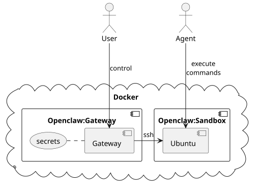
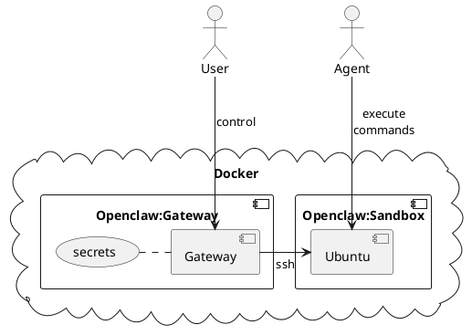
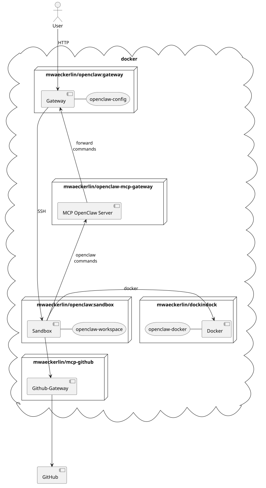
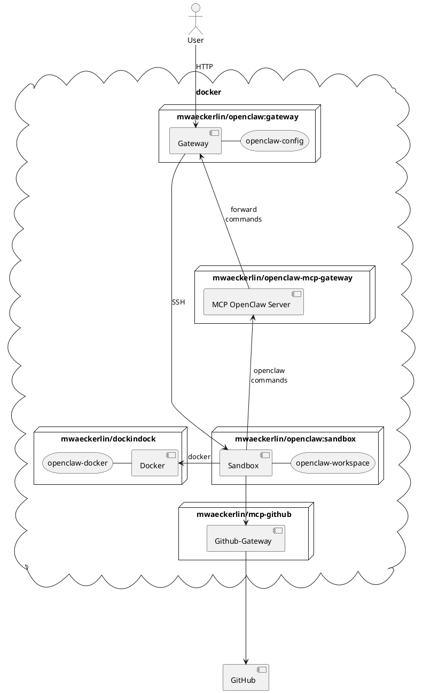

# Simple Secure OpenClaw in SSH Sandbox


Combine OpenClaw with Security and Easiness! Run out of the box a secure docker based sandboxed OpenClaw, locally or in a cloud.

## No Token for the AI

The AI agent never sees a token, a password or an API key, and it has no tool to ask you for one. Every credential stays in the gateway, which uses it on the agent's behalf; the agent works in a separate sandbox container that holds none. Each point below is enforced by the default configuration and checked by a test ([TESTS.md](TESTS.md)):

- The agent's commands and file tools run in the SSH sandbox, which receives no credential; its only key is the SSH public key.
- The agent has no tool to request a credential (`secrets` is denied), no tool that runs commands in the gateway (elevated mode is off), and no gateway, browser or web tool in its sandboxed sessions.
- The configuration file on the volume holds `${VARIABLE}` placeholders, never a token; OpenClaw fills them from the gateway's environment.
- LiteLLM, Hindsight and the channel integrations take their keys as Docker secrets of the gateway.
- The MCP bridge the sandbox uses removes tokens from every answer, also from log lines, including Telegram, Slack, GitHub and Discord tokens.

No configuration can stop a language model from writing a question into the chat. The agent is instructed never to ask for a credential and never to accept one; you still never send one. See [Your Part](#your-part) for this and for the settings that switch the protection off.

It has never been so easy to run a *secure* sandboxed pre-configured OpenClaw:

1. get an [OpenAI token](https://platform.openai.com/api-keys) (or use [LiteLLM](https://docs.litellm.ai/docs/))
2. write some [configuration variables in `.env`](#local-development-setup)
3. run `npm start`
4. open: [`http://localhost:18789/`](http://localhost:18789/)

- **Target audience:** Security aware **developer** with some basic docker know how. Everybody else: **Keep your hands away from OpenClaw!**

All features are listed in [FEATURES.md](FEATURES.md), all tests in [TESTS.md](TESTS.md). The sandbox builds on [mwaeckerlin/sandbox-base](https://github.com/mwaeckerlin/sandbox-base); docker-in-docker runs the rootless [mwaeckerlin/dockindock](https://github.com/mwaeckerlin/dockindock), which needs no host configuration.



<details>
<summary>PlantUML source</summary>


```plantuml
@startuml overview
cloud Docker {
  component [Openclaw:Gateway] {
    (secrets) . [Gateway]
  }
  component [Openclaw:Sandbox] {
    [Ubuntu]
  }
}
:User: --> [Gateway] : control
:Agent: --> [Ubuntu] : execute\ncommands
[Gateway] -> [Ubuntu] : ssh
@enduml
```

</details>

## Security Model

The primary security mechanism is **strict isolation**: The AI runs in a dedicated sandbox container that contains only its tools and workspace — no host secrets, no production data, no unrelated resources.

### Segregation in Container

- **Isolation in Segregated Container** — The gateway controls access and secrets. The agent has no direct access to the gateway (no tokens, no secrets). The agent cannot access files or variables or secrets defined on the gateway. *Never expose any secret to the sandbox!*
- **Access through MCP** — Where the SSH sandboxed agent cannot get access from the gateway, we add an MCP server that holds the token in a segregated container.
- **Container hardening** — `no-new-privileges`, `pids_limit: 256` against escalation and fork bombs

### Network Isolation

- **Network isolation** — Containers communicate on segregated internal networks. Every two containers have their own network.
- **Network Encryption** (production) — When going to production, *encrypt the networks* (e.g. encrypted overlay in docker swarm: for all networks set `networks.<network>.driver_opts.encrypted: "true"`, or add a service mesh)
- **No port over-exposure** — Only port 18789 (UI/API) is published, bound to `127.0.0.1` by default (override with `OPENCLAW_GATEWAY_BIND_ADDRESS`) for *local testing only*; internal ports stay internal. If you attach chat tool, such as [Telegram](https://telegram.org/), you can even close that port. You can then reach your OpenClaw through Telegram. *Do not expose 18789 to the Internet without further protection.* You may add e.g. [Traefik](https://doc.traefik.io/traefik/) service and an [Authentik proxy-provider outpost](https://docs.goauthentik.io/add-secure-apps/outposts) in front of OpenClaw when you want to access it through the internet.

Note: If networks are neither segregated nor encrypted, the agent can *sniff for secrets* on the shared or unencrypted network. So network isolation is crucial, and encryption is highly recommended at least in production.

### Secrets

- **Secrets** (production) — Use docker secrets instead of environment variables in docker swarm (or use a vault such as Hashicorps to deploy in e.g. Kubernetes). Secrets can be mounted on `/var/secrets/secret-name` and are then exported to the OpenClaw environment variables as `SECRET_NAME`.

### Additional Tools and Segregations

- **Docker-in-Docker isolation** — The agent runs docker commands against a dedicated rootless Docker daemon ([mwaeckerlin/dockindock](https://github.com/mwaeckerlin/dockindock)), segregated from your own docker installation. The daemon runs as an unprivileged user, so a break out of an inner container yields no root process. Restart the container to restore it; no host data is in danger.
- **OpenClaw-MCP-Gateway** — The project [mwaeckerlin/openclaw-mcp-gateway](https://github.com/mwaeckerlin/openclaw-mcp-gateway) runs an MCP server to give the sandbox limited access to the gateway to execute some safe `openclaw` CLI commands. It helps for self analysis and allows to setup cron jobs. Only the MCP server holds the gateway token, the sandbox has no access to the token.
- **MCP-Github** — The project [mwaeckerlin/mcp-github](https://github.com/mwaeckerlin/mcp-github) gives the sandbox access to the GitHub API. Only the MCP server holds the GitHub token, the sandbox has no access to the token.

### Hardened OpenClaw Setup

- **Workspace restriction** (`tools.fs.workspaceOnly: true`) — File tools limited to the sandbox workspace.  
  **Note:** The `workspaceOnly` setting restricts OpenClaw's **file tools** to the workspace. However, `exec`/shell commands can still read container system files (e.g. `/etc/passwd`, `/proc`). This is acceptable because the sandbox is an isolated container — there are no host secrets inside it.
- **Loop detection** (`loopDetection`) — Circuit breaker against tool/agent loops. That's more to prevent token over spending.

### `strictHostKeyChecking: false`

Acceptable in a controlled internal Docker network where DNS is managed by Docker. For production hardening, consider pinning host keys.

### Your Part

The protection holds with the defaults of this image. These actions remove it, and each is your own decision:

- **Sending a credential to the agent.** No language model can be prevented from asking a question in the chat, and whatever you type into a chat reaches the model and its transcript. Never send a token or a password to the agent, not even when it asks; if it happened, revoke that credential at once. Credentials belong into the gateway as Docker secrets.
- **Overriding the tool policy.** `OPENCLAW_TOOLS_ELEVATED_ENABLED=true` lets the agent run commands in the gateway, where every token lies in the environment. `OPENCLAW_TOOLS_DENY_JSON` without `"secrets"` gives the agent the tool to request credentials. `OPENCLAW_AGENT_SANDBOX_MODE` other than `all`, `OPENCLAW_TOOLS_JSON` and `OPENCLAW_AGENTS_JSON` replace the protected defaults as a whole. The defaults are safe; every override is yours.
- **Putting a credential into the sandbox.** Anything in the sandbox's environment, its workspace or a volume it mounts is readable by the agent. Keep secrets out of `openclaw-sandbox` and out of the workspace.
- **Wiring the sandbox to a credentialed service.** The agent cannot read the token of an MCP server such as `mcp-github`, but it can use everything that token permits. Give every service on the sandbox's networks a token with the smallest scope that does the job.

### Documented Security Trade-offs

These defaults trade security for local out-of-the-box usability. All are overridable via environment variables; review them before any non-local deployment:

- **Control UI relaxations** — `dangerouslyAllowHostHeaderOriginFallback` defaults to `true` (`OPENCLAW_CONTROL_UI_ALLOW_HOST_HEADER_ORIGIN_FALLBACK`), so the Control UI accepts the browser without a configured origin. Behind a public reverse proxy, set it to `false` and configure `OPENCLAW_ALLOWED_ORIGINS_JSON`. Since OpenClaw 2026.9, device pairing of the Control UI can no longer be switched off: a new browser is approved once, with the request id that `docker compose exec openclaw-gateway openclaw devices list` shows, by `docker compose exec openclaw-gateway openclaw devices approve <requestId>`. OpenClaw also logs this flag as a dangerous config flag on every start.
- **No trusted proxy** — `trustedProxies` defaults to `[]` (`OPENCLAW_TRUSTED_PROXIES_JSON`). OpenClaw refuses a client from a trusted address that sends no forwarded client headers, so a trusted range covering the docker networks would lock out the containers of this stack that talk to the gateway directly, such as the MCP gateway. Behind a reverse proxy, set exactly its address, e.g. `OPENCLAW_TRUSTED_PROXIES_JSON='["172.18.0.5/32"]'`; the gateway then reads the client address from the proxy's forwarded headers.
- **ACPX `permissionMode: approve-all`** — the gateway-side GitHub/Gitea MCP servers auto-approve all tool calls; the effective permission boundary is the scope of the token you provide (`OPENCLAW_GITHUB_TOKEN`/`OPENCLAW_GITEA_TOKEN`). Use minimal-scope tokens.
- **Chat channel policies** — all channels default to `dmPolicy: pairing` (unknown peers must be approved before the agent reacts); Telegram groups require an explicit mention by default. Loosening this (e.g. `OPENCLAW_TELEGRAM_DM_POLICY=open`) means anyone who finds your bot can drive the agent.
- **DinD without TLS** (`DOCKER_TCP_PORT: "2375"`) — the isolated Docker daemon listens unauthenticated on plain TCP, but only on the segregated `sandbox-dind` network, where the sandbox controls that daemon by design (see the DinD security warning below).

## Full Architecture



<details>
<summary>PlantUML source</summary>


```plantuml

@startuml architecture
actor User as user

cloud docker {

  node "mwaeckerlin/openclaw:gateway" as gw {
    [Gateway] as ctrl
    storage "openclaw-config" as cfg
    ctrl - cfg
  }

  node "mwaeckerlin/openclaw-mcp-gateway" {
    [MCP OpenClaw Server] as mcp
  }

  node "mwaeckerlin/openclaw:sandbox" as sb {
    [Sandbox] as sshd
    storage "openclaw-workspace" as ws
    sshd -right- ws
  }

  node "mwaeckerlin/dockindock" as dind {
    [Docker] as dd
    storage "openclaw-docker" as dv
    dd -left- dv
  }

  node "mwaeckerlin/mcp-github" {
    [Github-Gateway] as gh
  }
}

user --> ctrl : "HTTP"
ctrl --> sshd : "SSH"
sshd --up--> mcp : openclaw\ncommands
mcp --up--> ctrl : forward\ncommands
sshd -left-> dd : docker
sshd --> gh
gh ----> [GitHub]
@enduml
```

</details>

## Local Development Setup

For local testing with `docker compose` and `.env` file.

### 1. Generate SSH Keypair and .env

Simplest use is with an [OpenAI token](https://platform.openai.com/api-keys) that you store in `OPENAI_API_KEY`. All other secrets can just be randomly generated:

```bash
(umask 077
  ssh-keygen -t ed25519 -f openclaw-key -N "" -C "openclaw-sandbox"
  cat > .env <<EOF
OPENCLAW_GATEWAY_TOKEN=$(pwgen 40 1)
OPENCLAW_SANDBOX_SSH_PUBLIC_KEY=$(cat openclaw-key.pub)
OPENCLAW_SANDBOX_SSH_PRIVATE_KEY=$(sed -z 's/\n/\\n/g' openclaw-key)
OPENAI_API_KEY=sk-...[PLACE-TOKEN-HERE]
EOF
  rm openclaw-key openclaw-key.pub)
```

The `umask 077` keeps `.env` readable only by you — it contains all secrets.

### 2. Generate MCP Gateway Device Pairing

If you use the MCP gateway (enabled by default), generate a device keypair for secure gateway-to-MCP communication:

```bash
node generate-device-pairing.mjs
```

This appends `OPENCLAW_DEVICE_IDENTITY` and `OPENCLAW_DEVICE_PAIRING` to `.env`. The MCP gateway uses the private key to authenticate, and the OpenClaw gateway pre-registers the public key so the device is trusted on first connect.

Use `--stdout` to print the values instead of writing to `.env`.

### 3. Start

In the foreground, with the logs in real time:

```bash
npm start
```

In the background, as a daemon:

```bash
npm run start:daemon
```

Control UI: `http://localhost:18789/`

This setup is for local or trusted-network use only. The gateway token is transmitted unencrypted. The port is bound to `127.0.0.1` by default; do not expose it to the internet without a TLS reverse proxy.

### 4. Test

```bash
npm install
npm run build
npm test
```

`npm test` checks the feature and test registers, runs the unit tests of the configuration renderer (secret escaping, template defaults), checks the wiring of `docker-compose.yml`, and tests the built gateway image: for each group of environment variables, OpenClaw itself validates the rendered configuration, and the gateway has to start and answer `/healthz`. Finally it starts gateway and sandbox together with test credentials and checks that the agent gets no tool to request or reach a credential and that the sandbox holds none. All tests are listed in [TESTS.md](TESTS.md).

### 5. Images and Publishing

The gateway image `mwaeckerlin/openclaw:gateway` builds on the official [`openclaw/openclaw`](https://hub.docker.com/r/openclaw/openclaw) image, so every build takes the current OpenClaw release. The sandbox image `mwaeckerlin/openclaw:sandbox` builds on [mwaeckerlin/sandbox-base](https://github.com/mwaeckerlin/sandbox-base).

GitHub Actions ([.github/workflows/docker.yml](.github/workflows/docker.yml)) builds both images on every push and every Monday for amd64 and arm64, runs `npm test`, and publishes them on Docker Hub with the reusable workflow of [mwaeckerlin/scratch](https://github.com/mwaeckerlin/scratch). Besides `gateway` and `sandbox`, each image carries the tags `<tag>-YYYYMMDD`, `<tag>-<version>` and `<tag>-<version>-YYYYMMDD`, the version taken from `package.json`. `npm run deploy` pushes the locally built images.

## Full Configuration Guide

### Automatic Secret Mapping

The gateway entrypoint iterates over all files in `/run/secrets/` and exports each as an environment variable. The filename is uppercased and dashes are replaced by underscores, e.g.:

| Environment Variable | Secret Name | Alternative Secret Name |
|---|---|---|
| `OPENAI_API_KEY` | `openai_api_key` | `openai-api-key` |
| `OPENCLAW_SANDBOX_SSH_PRIVATE_KEY` | `openclaw_sandbox_ssh_private_key` | `openclaw-sandbox-ssh-private-key` |
| … | … | … |

The sandbox reads its public key directly from `/run/secrets/openclaw_sandbox_ssh_public_key` or alternatively `/run/secrets/openclaw-sandbox-ssh-public-key` (fallback when `OPENCLAW_SANDBOX_SSH_PUBLIC_KEY` is not set, `-` and `_` are interchangeable).

This means *any* Docker Secret is automatically available as an environment variable — no explicit mapping required. Secrets take precedence over environment variables.

No secret value is written into `openclaw.json`: the rendered configuration keeps a placeholder such as `"botToken": "${OPENCLAW_TELEGRAM_BOT_TOKEN}"`, and OpenClaw fills it from the gateway's environment when it loads the configuration. The file on the `openclaw-config` volume, and its raw text that the gateway returns in diagnostics, therefore carries no credential.

### Core Configuration

| Variable | Required | Description |
|---|---|---|
| `OPENCLAW_GATEWAY_TOKEN` | yes | Shared secret for Control UI |
| `OPENCLAW_SANDBOX_SSH_PUBLIC_KEY` | yes | SSH public key (ed25519) for sandbox access |
| `OPENCLAW_SANDBOX_SSH_PRIVATE_KEY` | yes | SSH private key, `\n`-encoded (gateway → sandbox) |

### Feature Configuration

| Variable | Required | Description |
|---|---|---|
| `OPENAI_API_KEY` | no | OpenAI API key; enables OpenAI provider, Whisper audio transcription, and is used as default model provider if `LITELLM_MASTER_KEY` is not set |
| `OPENCLAW_WHISPER_API_KEY` | no | Whisper API key override; if unset and `OPENAI_API_KEY` is set, the rendered configuration uses `OPENAI_API_KEY` for Whisper |
| `OVERWRITE_CONFIG` | no | Unset/true overwrites `openclaw.json` from the template on startup; set `false` to preserve manual edits |
| `OPENCLAW_CONFIG_DIR` | no | Host path for config (default: Docker volume) |
| `OPENCLAW_STATE_DIR` | no | OpenClaw state directory path inside the gateway container (defaults to `~/.openclaw`) |
| `OPENCLAW_GATEWAY_PORT` | no | Published host port of the gateway (default: 18789) |
| `OPENCLAW_GATEWAY_BIND_ADDRESS` | no | Host address the gateway port is published on; default `127.0.0.1` (loopback only). Trade-off: the Control UI uses plain HTTP token auth, so the port is not exposed beyond the local machine by default — set `0.0.0.0` explicitly for LAN access, and put a TLS reverse proxy in front for anything non-local |
| `GITHUB_TOKEN` | no | GitHub token for the separate `mcp-github` service (sandbox-side MCP); independent from `OPENCLAW_GITHUB_TOKEN`, which enables the gateway-side ACPX GitHub MCP server |
| `OPENCLAW_LOGGING_LEVEL` | no | Gateway log level (default: `info`). Trade-off: `debug` logs request details and may leak sensitive data into logs — use it only temporarily for diagnosis |
| `OPENCLAW_ELEVENLABS_API_KEY` | — | ElevenLabs API key; enables TTS via ElevenLabs (else Microsoft TTS) |
| `OPENCLAW_NOTION_API_KEY` | — | Notion API key; enables Notion skill |
| `OPENCLAW_GITHUB_TOKEN` | — | GitHub personal access token; enables GitHub MCP server via ACPX (token stays gateway-side, sandbox only sees MCP tools) |
| `MCP_GITHUB_URL` | no (compose default) | MCP GitHub endpoint used from the sandbox. Default in this setup: `http://mcp-github:4000`. This value is written to `/etc/environment` by the sandbox entrypoint so the non-root SSH user can read it. |
| `OPENCLAW_GITEA_HOST` | — | Gitea host URL for ACPX MCP server setup |
| `OPENCLAW_GITEA_TOKEN` | — | Gitea personal access token; enables Gitea MCP server via ACPX |
| `OPENCLAW_GITEA_INSECURE` | — | Optional Gitea MCP setting (`GITEA_INSECURE`) |
| `OPENCLAW_TRELLO_API_KEY` | — | Trello API key; enables Trello skill |
| `OPENCLAW_TELEGRAM_BOT_TOKEN` | — | Telegram bot token; enables Telegram channel |
| `OPENCLAW_DISCORD_BOT_TOKEN` | — | Discord bot token; enables Discord channel |
| `OPENCLAW_SLACK_BOT_TOKEN` | — | Slack bot token; enables Slack channel |
| `OPENCLAW_SLACK_APP_TOKEN` | — | Slack app token for socket mode (`channels.slack.appToken`) |
| `OPENCLAW_BRAVE_API_KEY` | — | Brave Search API key; enables Brave plugin (else DuckDuckGo, which OpenClaw installs from npm on the first start) |
| `OPENCLAW_GOOGLECHAT_SERVICE_ACCOUNT_JSON` | — | Google Chat service account JSON; enables Google Chat channel |
| `OPENCLAW_GOOGLECHAT_SERVICE_ACCOUNT_FILE` | — | Path to Google Chat service account file |
| `OPENCLAW_MATTERMOST_BOT_TOKEN` | — | Mattermost bot token; enables Mattermost channel |
| `OPENCLAW_MATTERMOST_BASE_URL` | — | Mattermost base URL |
| `OPENCLAW_MATRIX_HOMESERVER` | — | Matrix homeserver URL |
| `OPENCLAW_MATRIX_ACCESS_TOKEN` | — | Matrix access token; enables Matrix channel |
| `OPENCLAW_MSTEAMS_APP_ID` | — | Microsoft Teams app ID |
| `OPENCLAW_MSTEAMS_APP_PASSWORD` | — | Microsoft Teams app password |
| `OPENCLAW_MSTEAMS_TENANT_ID` | — | Microsoft Teams tenant ID |
| `OPENCLAW_IRC_NICKSERV_PASSWORD` | — | IRC NickServ password |

### LiteLLM Configuration

When `LITELLM_BASE_URL` or `LITELLM_MASTER_KEY` is set, LiteLLM is enabled as model provider and the default model switches to `litellm/openrouter/~moonshotai/kimi-latest`. Without LiteLLM, OpenClaw uses `openrouter/~moonshotai/kimi-latest` when `OPENROUTER_API_KEY` is set, otherwise `openai/gpt-4.6`.

Without a key in the gateway: set only `LITELLM_BASE_URL` to a proxy in front of LiteLLM that puts the credential (a scoped virtual key) into the `Authorization` header. OpenClaw sends no provider request without some key, so the gateway sends the fixed public value `Bearer proxy-supplied`, which the proxy replaces; model discovery sends no header. The gateway container then needs no `litellm_master_key` secret.

| Variable | Default | Description |
|---|---|---|
| `LITELLM_MASTER_KEY` | — | Bearer token for LiteLLM API authentication; leave unset when a proxy adds the credential |
| `LITELLM_API_KEY` | — | Scoped LiteLLM virtual key, e.g. as Docker secret `litellm_api_key`; takes precedence over `LITELLM_MASTER_KEY` |
| `LITELLM_URL` | `LITELLM_BASE_URL` | Base URL of LiteLLM for model discovery |
| `LITELLM_BASE_URL` | `http://litellm:4000` | Base URL for connecting to LiteLLM; enables the provider on its own |

### Hindsight Memory

[Hindsight](https://github.com/vectorize-io/hindsight) serves one MCP endpoint per memory bank, `http://<service>:8888/mcp/<bank_id>/`. The agent gets two of them as MCP servers, `hindsight-shared` and `hindsight-openclaw`:

| Variable | Default | Description |
|---|---|---|
| `OPENCLAW_HINDSIGHT_SHARED_URL` | — | MCP URL of the bank all agents share |
| `OPENCLAW_HINDSIGHT_OWN_URL` | — | MCP URL of the bank of this agent |
| `OPENCLAW_HINDSIGHT_TRANSPORT` | `streamable-http` | MCP transport of both servers (`streamable-http` or `sse`) |
| `OPENCLAW_HINDSIGHT_API_KEY` | — | Key the gateway sends to both banks as `Authorization: Bearer`, e.g. as Docker secret `openclaw_hindsight_api_key` |

`OPENCLAW_MCP_JSON`, when set, replaces the whole `mcp` section, the Hindsight servers included.

### Development with OpenCode

The agent hands every software development task to the central [OpenCode](https://opencode.ai) server of the cluster, which works in its own workspace and is tuned for exactly that. The sandbox carries the OpenCode client, taken from the published [`mwaeckerlin/opencode:sandbox`](https://hub.docker.com/r/mwaeckerlin/opencode) image so that it matches the server's release, and the command `opencode-delegate "<task>"`, which the skill `opencode-delegation` tells the agent to use: it sends the task to OpenCode's HTTP API, waits until OpenCode is done, and prints the answer into the conversation, with the session id for a follow-up (`--session <id>`). `opencode run --attach` reaches the server as well, but in OpenCode 1.18 it prints no answer without a terminal.

| Variable | Default | Description |
|---|---|---|
| `OPENCLAW_OPENCODE_URL` | — | URL of the OpenCode server (`opencode serve`, default port 4096), e.g. `http://opencode:4096`; set on the sandbox service; empty: no delegation |
| `OPENCLAW_OPENCODE_TIMEOUT` | `7200` | Seconds a delegated task may take before `opencode-delegate` stops waiting; set on the sandbox service |

The sandbox reaches OpenCode directly, so it shares a network with the OpenCode server, and nothing else of the stack needs to. OpenCode's optional password (`OPENCODE_SERVER_PASSWORD` on the server) never belongs into the sandbox, because the agent could read it there. Where the network between sandbox and OpenCode is not closed, put a proxy in front of OpenCode that adds the password as HTTP basic auth (user `opencode`), and point `OPENCLAW_OPENCODE_URL` at the proxy.

When configured, model lists are discovered dynamically from providers:

- LiteLLM: `LITELLM_URL/v1/models` → `models.providers.litellm.models`
- OpenAI: `${OPENCLAW_OPENAI_BASE_URL:-https://api.openai.com/v1}/models` → `models.providers.openai.models` (unless `OPENCLAW_OPENAI_MODELS_JSON` is explicitly set)

### Agent & Model Configuration

| Variable | Default | Description |
|---|---|---|
| `OPENCLAW_PRIMARY_MODEL` | _(auto)_ | Default LLM model; auto-selects `litellm/openrouter/~moonshotai/kimi-latest` with LiteLLM, `openrouter/~moonshotai/kimi-latest` with OpenRouter, else `openai/gpt-4.6` |
| `OPENCLAW_HEARTBEAT_INTERVAL` | `0s` | Duration for agent heartbeat (e.g. `30m`, `2h`, `0s` = disabled) |
| `OPENCLAW_TIMEOUT_SECONDS` | `300` | Agent execution timeout in seconds |
| `OPENCLAW_MAX_CONCURRENT` | `5` | Maximum concurrent agents |
| `OPENCLAW_CRON_ENABLED` | `true` | Enable cron scheduler support |
| `OPENCLAW_BASE_PATH` | _(empty)_ | Base path for Control UI (e.g. `/openclaw` behind reverse proxy) |
| `OPENCLAW_AGENT_SCOPE` | `agent` | Sandbox scope for agent sessions; allowed: `session`, `agent`, `shared` |
| `OPENCLAW_DM_SCOPE` | `main` | DM scope for session routing; allowed: `main`, `per-peer`, `per-channel-peer`, `per-account-channel-peer` |
| `OPENCLAW_SESSION_VISIBILITY` | `agent` | Session visibility for tools; allowed: `agent`, `global` |
| `OPENCLAW_SESSION_TOOLS_VISIBILITY` | `all` | Which tools are visible in sandbox sessions; allowed: `all`, `none` |

### Plugin Configuration & Installation

| Variable | Default | Description |
|---|---|---|
| `OPENCLAW_PLUGINS_JSON` | — | Full `plugins` section as JSON |
| `OPENCLAW_PLUGIN_ENTRIES_JSON` | — | Additional `plugins.entries` object merged into the generated config |
| `PLUGINS` | — | Manual install spec passed to `openclaw plugins install` |

Example:

```bash
OPENCLAW_PLUGIN_ENTRIES_JSON='{"matrix":{"enabled":true,"config":{"homeserver":"https://matrix.example","accessToken":"${OPENCLAW_MATRIX_ACCESS_TOKEN}"}}}'
PLUGINS='@openclaw/matrix'
```

### Schema Root Sections

Each root section in `files/openclaw.json.j2` is configurable via a section JSON variable:

`OPENCLAW_<SECTION>_JSON`

Example:

```bash
OPENCLAW_GATEWAY_JSON='{"mode":"local","bind":"lan","port":18789,"auth":{"mode":"token","token":"${OPENCLAW_GATEWAY_TOKEN}"}}'
```

Supported section variables (from official OpenClaw schema roots):

`OPENCLAW_META_JSON`, `OPENCLAW_ENV_JSON`, `OPENCLAW_WIZARD_JSON`, `OPENCLAW_DIAGNOSTICS_JSON`, `OPENCLAW_LOGGING_JSON`, `OPENCLAW_UPDATE_JSON`, `OPENCLAW_TELEMETRY_JSON`, `OPENCLAW_BROWSER_JSON`, `OPENCLAW_UI_JSON`, `OPENCLAW_SECRETS_JSON`, `OPENCLAW_AUTH_JSON`, `OPENCLAW_ACCESS_GROUPS_JSON`, `OPENCLAW_ACP_JSON`, `OPENCLAW_MODELS_JSON`, `OPENCLAW_NODE_HOST_JSON`, `OPENCLAW_AGENTS_JSON`, `OPENCLAW_WORKTREE_ROOT_JSON`, `OPENCLAW_WORKTREE_ACCELERATION_JSON`, `OPENCLAW_TOOLS_JSON`, `OPENCLAW_SECURITY_JSON`, `OPENCLAW_BINDINGS_JSON`, `OPENCLAW_BROADCAST_JSON`, `OPENCLAW_ATTACHMENTS_JSON`, `OPENCLAW_MESSAGES_JSON`, `OPENCLAW_TTS_JSON`, `OPENCLAW_COMMANDS_JSON`, `OPENCLAW_APPROVALS_JSON`, `OPENCLAW_SESSION_JSON`, `OPENCLAW_CRON_JSON`, `OPENCLAW_TRANSCRIPTS_JSON`, `OPENCLAW_HOOKS_JSON`, `OPENCLAW_CHANNELS_JSON`, `OPENCLAW_DISCOVERY_JSON`, `OPENCLAW_TALK_JSON`, `OPENCLAW_GATEWAY_JSON`, `OPENCLAW_CLOUD_WORKERS_JSON`, `OPENCLAW_DESKTOP_JSON`, `OPENCLAW_MEMORY_JSON`, `OPENCLAW_MCP_JSON`, `OPENCLAW_SKILLS_JSON`, `OPENCLAW_PLUGINS_JSON`, `OPENCLAW_SURFACES_JSON`, `OPENCLAW_PROXY_JSON`.

The value is JSON, also for a root that is a single value: `OPENCLAW_WORKTREE_ROOT_JSON='"/home/node/worktrees"'`.

If `OPENCLAW_<SECTION>_JSON` is set, it replaces that full section from the template. If not set, the template defaults and feature toggles apply.

Plugin configurations are supported in two modes:

- complete plugin section replacement via `OPENCLAW_PLUGINS_JSON`
- additive plugin entry mapping via `OPENCLAW_PLUGIN_ENTRIES_JSON`

### Individual Overrides (Per-Parameter)

In addition to section-level JSON overrides, common single settings can be overridden directly via environment variables.

Most useful groups:

- Models and providers: `OPENCLAW_MODELS_MODE`, `OPENCLAW_OPENAI_BASE_URL`, `OPENCLAW_OPENAI_MODELS_JSON`, `OPENCLAW_LITELLM_*`, `OPENCLAW_AGENT_MODELS_JSON`
- Agent runtime: `OPENCLAW_AGENT_SANDBOX_MODE`, `OPENCLAW_AGENT_WORKSPACE_ACCESS`, `OPENCLAW_SUBAGENT_*`
- Tools and media: `OPENCLAW_TOOLS_DENY_JSON` (default `["secrets"]`), `OPENCLAW_TOOLS_ELEVATED_ENABLED` (default `false`), `OPENCLAW_TOOLS_FS_WORKSPACE_ONLY`, `OPENCLAW_LOOP_DETECTION_*`, `OPENCLAW_MEDIA_AUDIO_*`, `OPENCLAW_TTS_*`
- Messaging and hooks: `OPENCLAW_MESSAGES_QUEUE_*`, `OPENCLAW_COMMANDS_*`, `OPENCLAW_HOOKS_*`
- Channels: `OPENCLAW_TELEGRAM_*`, `OPENCLAW_DISCORD_*`, `OPENCLAW_SLACK_*`, `OPENCLAW_WHATSAPP_*`, `OPENCLAW_GOOGLECHAT_*`, `OPENCLAW_MATTERMOST_*`, `OPENCLAW_SIGNAL_*`, `OPENCLAW_IRC_*`
- Gateway and UI: `OPENCLAW_GATEWAY_*`, `OPENCLAW_CONTROL_UI_*`, `OPENCLAW_ALLOWED_ORIGINS_JSON`, `OPENCLAW_TAILSCALE_*`, `OPENCLAW_TRUSTED_PROXIES_JSON`
- Plugins and MCP/ACPX: `OPENCLAW_PLUGIN_*`, `OPENCLAW_ACPX_*`, `OPENCLAW_GITHUB_TOKEN`, `OPENCLAW_GITEA_*`, `PLUGINS`

For token/secret-based channels, there is intentionally no separate `*_ENABLED` toggle: the token/secret is the feature enabler.

Special case:

- `OPENCLAW_ALLOWED_ORIGINS_JSON` sets `gateway.controlUi.allowedOrigins`.
- There is no built-in default for `allowedOrigins`; if not set, the field is not written.

Model handling:

- Agent model mappings can be set via `OPENCLAW_AGENT_MODELS_JSON`.
- Provider model catalogs are managed per provider (`models.providers.*.models`), including LiteLLM discovery via `LITELLM_URL` + `LITELLM_MASTER_KEY`.

For a full technical variable reference, use the gateway service environment block in `docker-compose.yml` and the template defaults in `files/openclaw.json.j2`.


## Docker-in-Docker (Optional)

The `openclaw-dind` service provides an isolated Docker daemon for the sandbox. It is **optional** — simply remove the `openclaw-dind` service and the `DOCKER_HOST` environment variable from the sandbox to disable it.

Developers and DevOps engineers need it when OpenClaw shall autonomously build, run, and test containerized applications. For general use (writing, research, scripting), DinD is not needed.

Security warning: The AI has full control of the DinD daemon. It can destroy all inner images and containers or exhaust disk space on the `openclaw-docker` volume. The daemon is rootless, so a break out of an inner container ends as the daemon's unprivileged user, and it is isolated from the host Docker. Only enable this if you accept that risk.

### DinD in Docker Swarm

Docker Swarm does not support `privileged: true` in stack deploy files. Docker-in-Docker is therefore not supported in this Swarm setup.

### Production Checklist

- [ ] All secrets via `docker secret`, not environment variables
- [ ] Encrypted overlay network (`--opt encrypted`)
- [ ] Port 18789 behind TLS reverse proxy (nginx, Traefik, Kong)
- [ ] Firewall restricts access to gateway port
- [ ] Consider `read_only: true` + `tmpfs` mounts if OpenClaw supports it
